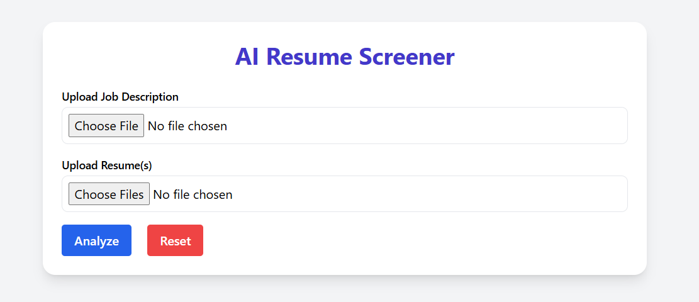
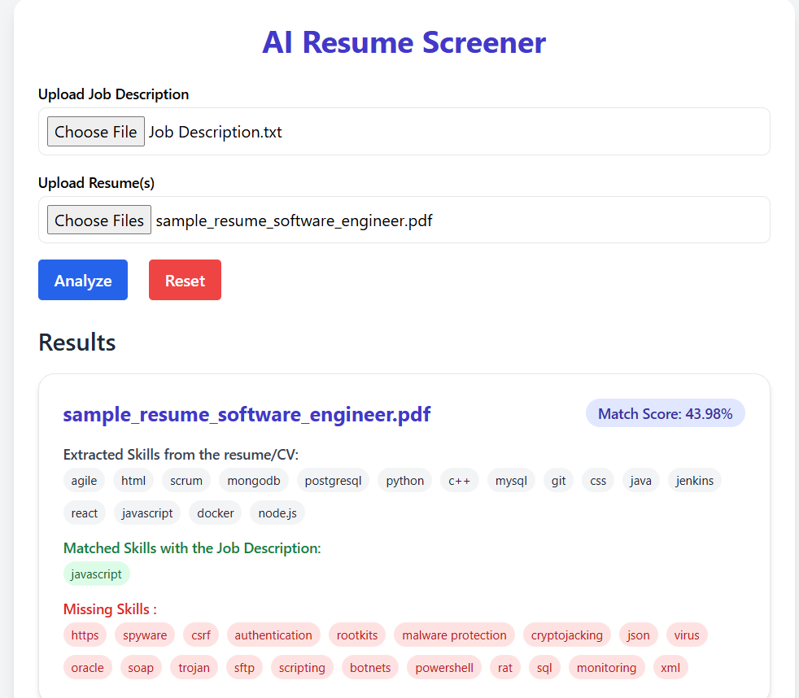

# 🧠 AI Resume Screener

An intelligent web-based tool built with **Flask** and styled using **Tailwind CSS** that analyzes resumes against a job description and provides a **match score** along with extracted, matched, and missing skills.

## 🚀 Features

- Upload a job description and multiple resumes
- Automatically extracts skills using NLP
- Calculates a match score for each resume
- Highlights matched and missing skills
- Clean and modern UI using Tailwind CSS
- Responsive and user-friendly

## 🖼️ Demo

-Once documents are uploaded and analyzed, the following output will be displayed accordingly.

## 🛠️ Tech Stack

### 🌐 Frontend
HTML5 – Markup for the user interface

Tailwind CSS – Utility-first CSS framework for modern, responsive UI design

JavaScript (Vanilla) – Handles form submission and dynamic content display

### 🧠 Backend
Python 3 – Core programming language for logic and AI model integration

Flask – Lightweight web framework for handling routes and APIs

### 🤖 AI / NLP
Scikit-learn – For implementing matching logic and possible vectorization

Natural Language Processing (NLP) – Used for extracting and comparing skills

Custom Skill Matching Algorithm – Parses and evaluates skills against job description

### 🗄️ File Handling & Data
File Upload System – Upload and process .txt, .pdf, .docx resumes and job descriptions

Text Parsing Libraries – (e.g., python-docx, PyPDF2) for resume and JD extraction

Custom Skill Set Dataset – List of tech skills used for comparison

### 💾 Version Control / Deployment
Git – Version control

GitHub – Code hosting and collaboration

(Optional) Heroku / Render / Vercel – For hosting the web app online

